Components
==========

This section is based on documentation created by Louis Jackowski-Ashley,
Sam Russell and Richard Grafton who also created the images used here.

All hex8 wires/ports carry a 4 bit signal. The following kinds of signals exist.

  * Clock signal (green in ModuleSim).
  * Data signal (red in ModuleSim).
  * Control signal (blue in ModuleSim).

ModuleSim uses purple for signals which are a combination of control and
data, and gray for everything else. These are not mistakes - you will have
purple and gray wires in your processor.

As a rule of thumb, the control port (right hand side) of all registers should
be connected to a green wire - if this is not the case, you're probably blocking
the reset signal - and apart from passing split/merges these should be the only
uses of green wires in your design. Furthermore, the less you pass green wires
through fan-outs, the better: it is possible to build a complete hex8 processor
without any fan-outs on green wires at all.

When discussing a signal, "bit 0" means the least significant (rightmost) bit,
"bit 1" is its neighbour and "bit 3" is the most significant (leftmost) bit.
Thus `0010` is a number with bit 1 set (we count from the right, but the first
one is bit 0) and `1100` is a number with bits 0 and 1 at zero and bits 2 and 3
set to 1.

Sometimes we use a `*` to indicate a bit that doesn't matter. Thus when we say
a control input of `**1*` resets a register we mean that if bit 1 is set, the
register resets whatever the other bits are.

Register
--------

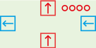

A register stores a 4 bit value and outputs this on its data output port (top).
When the control input (right) is `*101`, that is bits 0 and 2 are 1, bit 1 is 0
and bit 3 can be anything, the register copies the value from its data input
(bottom) into its storage. When the control input is `**1*`, the register resets
its storage to `0000`.

Register storage is erased if the register loses power (i.e. you disconnect all
cables).

The control output (left) is always an exact copy of the control input.

**Warning**: as long as something is connnected to the control input, a register
operates exactly as described. If the control input is disconnected, the control
input defaults to `0101` and not `0000` as one might imagine, i.e. a register
with its control input disconnected works as if it were just a wire from data
in to data out.

### Use

You can chain two registers to make an 8-bit register. Simply connect the
control out (left) of the right register to control in (right) of the left
register.

The control in of a register should always be either a raw clock signal (either
directly from the clock or chained through other registers on the way) or a
properly split/merged clock signal. This ensures that pressing the reset button
on the clock will reset all registers.

We call bit 0 of a register's control signal the clock bit and bit 2 the enable
bit. A register only stores its input if both these bits are set (and bit 1,
the reset bit, is zero). This allows us to create registers that only store a
value if both a certain clock phase is active and a certain condition is true.

Fanout
------

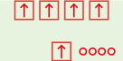

A fanout simply takes one input (bottom) and repeats it 4 times (top).

### Use

The only thing to say here is **NOT** to use fanouts when you can avoid it. You
can often avoid using fanouts by chaining signals. For example, if you want to
drive two registers with the same control signal, just connect control out from
one register to control in of the other. Similarly, if you want a data signal to
activate two chained or modules, chain the signal through the first into the
second. That is why they are called chained or after all.

Using fanouts is unavoidable if you have the output value of a register and you
want to send it to e.g. two different AUs.

Clock
-----

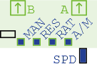

The clock component has two outputs "A" and "B" and cycles between the following
four states:

  * A = `0000`, B = `0000` (all off)
  * A = `0001`, B = `0000` (phase "a")
  * A = `0000`, B = `0000` (all off)
  * A = `0000`, B = `0001` (phase "b")

The switches and buttons control the clock speed and auto/manual mode. In auto
mode, the "rate" switch selects "fast" or "slow" and the speed dial allows this
to be more finely tuned. In manual mode, which can be selected by changing the
auto/manual switch, the clock does not move by itself and you press the "manual"
button to advance the clock by one state on each press.

The reset button sends a signal of `**1*` on both outputs, causing any registers
connected to either clock output to reset to `0000`. A good processor design
must ensure that the reset signal reaches **all** registers whenever the reset
button is pressed.

The clock is also a source of power.

### Use

Use exactly one clock in your design and make sure all registers are connected
to it in such a way that the reset signal works. You will want to create a
system that lets you pretend you had a clock with more than 2 phases, details of
which will be in the exercises for your computer architecture unit.

Multiplexor
-----------

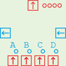

The multiplexor takes 4 data inputs (bottom), selects one of them with the help
of a control signal (right) and outputs it (top). The control output on the left
is an exact copy of the control input on the right, allowing you to chain two
multiplexors to make an 8-bit multiplexor for example.

The multiplexor only cares about the low 2 bits of its control signal and
selects the output accordingly:

  * `**00` selects input A (this is the default).
  * `**01` selects input B.
  * `**10` selects input C.
  * `**11` selects input D.

### Use

Multiplexors have two uses. The first is to select one of multiple inputs, e.g.
if you have a register that you sometimes want to have connected to another
register and sometimes to memory, you place a multiplexor in front of it and
use the control signal to select which of the two inputs to pass through.

The second use is as a switch. If you want a module to sometimes get input X and
sometimes input Y (where both X and Y are 4-bit values), you can set up a
multiplexor with X on input A and Y on input B and then use a 1-bit control
signal (e.g. you only need to care about bit 0) to switch between X and Y.

A variation of the second use is an "and" switch. If you want a certain wire to
be `0001` when both X and Y are `0001`, otherwise `0000` then you can set up a
multiplexor with the A, C, D inputs empty, X connected to B and Y to the control
input (or the other way round).

  * When Y is `0000`, the multiplexor is passing through its A input which is
    also `0000`.
  * When Y is `0001` and X is `0000` then the multiplexor is outputting X, so
    the output is still `0000`.
  * When both X and Y are `0001` then the multiplexor is passing through its B
    input (as Y is `0001`), but that is X so you get an output of `0001`.

This is a useful technique to do the logical "and" of 1-bit control signals.
Better still, the Y signal is available for further uses on the control out of
the multiplexor so you can save a fan-out in some cases.

Demultiplexor
-------------

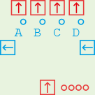

The complement of a multiplexor. One data input on the bottom, four data outputs
on the top of which three are `0000` at any one time and the fourth one is a
copy of the data input.

The control signal is passed through from right to left and the low two bits
determine the output: `**00` = A, `**01` = B, `**10` = C, `**11` = D.

### Use

The basic use of a demultiplexor is to take a 2-bit input signal, which has 4
possible values, and turn it into a 1-bit signal on any one of four outputs.
In this way you can "decode" a signal: if it's 00 then do this, if it's 01 then
do that etc. In this case the data input can be a fixed input component set to
`0001`.

Input
-----

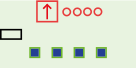

The input component has one data output on which it outputs whatever its
switches are set to. It also contains a power source.

### Use

The input provides a fixed input value. If you want a loop that always adds 1
to a value on each pass, one way to do this is to use an input set to `0001`
connected to an AU somewhere.

Another use of an input is as a power source.
All wires carry power as well as their 4 bit value so a component is powered if
it is connected to any powered components by any wires, even if the 4-bit signal
is not passed through in any way. Until you build something the size of the
wall computer, you do not need to worry about power too much.

Chained OR
----------

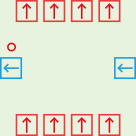

Performs a logical OR on 1-bit signals.

The control output is `0001` if any of the four data inputs or the control input
is `***1`, otherwise (if bit 0 is 0 on all inputs) the control output is `0000`.

The four data outputs are simply the four data inputs passed through unchanged.

### Use

Chained ORs are used to create a stateless control grid in the hex8 machine,
a.k.a. "the bit on the bottom" of the wall computer. The basic idea is this.
Suppose you want a register to be written two in exactly 5 different machine
instructions. You make one signal (one wire) for each instruction. You make a
chained OR with at least 5 inputs (i.e. you chain two of them together) and put
these 5 instruction wires in the data inputs, then connect the control output to
the place that controls the register in question (together with a clock signal).

Maybe you want two of these instructions, along with a third one that should not
activate the register from before, to do something else. You can place another
chained OR and feed the wires for the 3 instructions in question into that one.
And so on. The wire for a single instruction will take a path through all the
chained ORs that are relevant to this instruction, so a "read from memory and
write to the B register" instruction would have a wire that passes through the
"read from memory" and "write to B" chained ORs.

Chained ORs can be chained in two dimensions. To make a chained OR component
with more than 4 data inputs, just chain control out of one chained OR to the
control input of another. To make a signal for an instruction activate several
different chained ORs, chain a data output of one chained OR to a data input of
another.

Split/merge
-----------

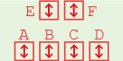

The Swiss Army Knife component - it has many uses.

On the one hand this is the simplest component (except perhaps the fanout) - it
is just a bunch of wires. On the other hand, the pattern of the wires is quite
complex.

On a real split/merge component, the bits marked X on the different inputs are
not connected to anything and the bits marked A-D are connected to all other
bits with the same letter. For example, input "C" (second rightmost of the four
ports in a row if you hold the split/merge so that the row of 4 is on the
bottom) is marked `XXXB` and input "F" (rightmost of the two ports on top) is
marked `DCBA`. This means that if you put a signal of `***1` in input "C", i.e.
any signal where bit 0 is 1 then bit 2 of the "F" port will be 1 (the others
will be 0 unless some other port is doing something to them).

### Use

The first use is to split or combine two 2-bit signals into one 4-bit signal.
Holding the split-merge so that the row of 2 ports is on top, place the wire for
the 4-bit signal in port "F" and the two two-bit signals in ports "B" and "D".
This assumes that the 2-bit signals both use bits 0 and 1.

This is the recommended way to control a register. Recall that on the control
input of a register, bit 1 is the reset signal and bits 0 (clock) and 2 (enable)
togther enable writing. Bits 0 and 1 should come from the clock and bit 2 from
wherever the register should be controlled from.

So if you want a register that is enabled for writing in clock phase 4a only,
take a split/merge and connect port "F" to the register's control input. Connect
the clock phase "a" to port "D" - this not only sends the clock bit in the "a"
clock phases, but also the reset signal whenever you activate it - and connect
the "phase 4" signal to port "B". This way, bit 2 on port "F" will be enabled
in clock phases 4a and 4b and bit 0 will be enabled in 1a, 2a, 3a, 4a with the
result that both bits 0 and 2 are only on together in 4a - which is exactly when
we want our register to write in this example.

To avoid fanouts, you can chain the signals as follows. If you have created a
register clocked at 4a with a split-merge, you can chain the register's control
output into another split merge at port "D" to recover the "a" signal, while
passing the reset signal through correctly too. The "4" signal you can chain
out of the "E" port since the "B" and "E" ports always carry the same signal.

Another use of a split/merge is to combine or split two 1-bit signals into a
2-bit signal. Put the 1-bit signals in "C" and "D" and the two-bit signal in "F".
This relies on the 1-bit signals really being 1-bit, particularly the signal
on port "D" can vary between `0000` and `0001` but must never be `**1*` as this
conflicts with the "C" port.

To split one 4-bit signal into 4 1-bit signals (or combine them), put the 4-bit
signal in port "F" and the 1-bit signals will be on ports A-D.

Arithmetic Unit
---------------

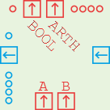

This component takes two data inputs A and B, performs arithmetic and comparison
operations and outputs the result on two data outputs (top). The result of the
arithmetic operation is a 4-bit signal that is also displayed on the group of 4
LEDs; the comparison operation produces a 1-bit output that is also displayed on
the single LED in the top left corner.

The operations are controlled by the control input (right). The low two bits
select an operation (carry bits will be discussed in a moment):

| bits | arithmetic | comparison |
|------|------------|------------|
| `**00` | A+B | A + B == 0 |
| `**01` | A   | A == 0 |
| `*110` | A - B | A == B |
| `*111` | A - B | A < B |

### Carry bit

Bit 2 is the carry bit. Bit 3 (the leftmost) you can ignore for now.
The control output on the left passes the low 2 bits through from the control
input but sets or clears the carry bit depending on whether the arithmetic
operation caused a carry out. This way, two chained AUs work as an 8-bit unit.

### Use - arithmetic

In addition mode (`**00`), the actual computation is `A + B + carry_in` and the
outputs are both the 4-bit value on the arithmetic data output and the carry bit
of the control output, set if the computation caused a carry out. For example,
A = `1110` and B = `0001` with carry in at 0 produces `1111` on the arithmetic
output and 0 for carry out. If you set carry in to 1, the arithmetic output
becomes `0000` and the carry out becomes 1 as you are now computing

    1110 + 0001 + 1 = 10000

The control input `*001` ignores the B input and just passes the A input through
to the output. This is useful when you just want to send a signal straight
through the AU as if it were a wire. The control input `*101` (pass through A,
carry one) adds 1 to A. This is a quick way to increment a number by 1 without
having to create an `0001` data input.

In subtraction mode, the AU by default does one's complement (A + NOT B) but
setting the carry bit produces (A + NOT B + 1) which is exactly two's complement
subtraction. Therefore to compute A - B you should set the control input to
`*11*` (in practice, `0110`).

### Use - comparison

The comparison output depends on the arithmetic output. It will be either `0000`
or `1111`. The most useful control modes are `0001` which checks if the A input
(plus a carry, if provided) is all zero and `0111` which checks if A < B, to be
precise whether bit 3 of (A - B) is set. If B is all zero then this mode simply
checks whether bit 3 of A is set. (To check whether the low bit of A is set you
could use a split-merge using ports "A" and "F".)

### Note - control bit 3

When chaining AUs and comparing say `0000 0001` and `0000 0000` for equality
(control input `0000`) you might wonder how the "left" AU knows that it should
output `0000` not `1111` on the comparison output, since the two inputs are
different but the only difference is in the "right" 4 bits and there is no
carry. This is what bit 3 of the control output is for: it is used to pass the
comparison result up a chain of AUs. Since the right AU sees two different
inputs it will set bit 3 on the control output, causing the left AU to report
`0000` as the comparison result whatever its inputs are. The meaning of this bit
depends on the comparison mode and you should not need to worry about the exact
rules nor should you use this bit for anything except chaining two AUs.

Non-Volatile Memory
-------------------

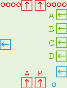

A non-volatile memory stores up to 2^15 8-bit values. For the 8-bit hex machine
we will only be able to address 2^8 = 256 of these values. For this, we use
address inputs "A" and "B" and leave "C" and "D" unconnected.

Like a register, the memory always outputs a stored value on its data outputs
and it replaces a stored value with the one on its data inputs if the control
signal (blue) is `*1*1`. The memory does not react to the "reset" signal `**1*`.
Unlike a register, the memory also has address inputs that select which of the
stored values to read/write.

The memory also has a safety feature: it will only allow writing if the two pins
forming the "write enable" switch are connected. In the simulator, this can be
done by clicking the switch; on a real memory unit use a NAND board cable.

### Use

To read a memory value, say the one at location `0000 0001`, set A = `0001` and
B = `0000`, i.e. A is the least significant (rightmost) 4 bits of the address.
The 8-bit value appears on the data output (top) ports.

To write a memory value, set the address up the same, put the value to write on
the data inputs and then set the control to `0101` - typically this will be a
combination of a clock and an enable signal.

Until you come to the point when you are implementing memory writes, leave the
write enable switch off - but don't forget to turn it on when you start building
the write instruction circuitry.

### Programming

To program a memory module in the simulator, right-click it and choose "View /
Edit NRAM Data". In the window that opens you can see the memory contents and
changes to memory (writes) will show up in blue as a program executes. The menu
lets you save and load hex-encoded data from files.

Logic Unit
----------

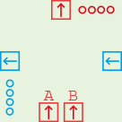

The logic unit takes two data inputs, performs a bitwise logical operation and
outputs the result. The control signal is passed through from right to left and
has the following meaning.

| signal | operation |
|--------|-----------|
| `**00` | NOT A     |
| `**01` | A AND B   |
| `*110` | A OR B    |
| `*111` | A XOR B   |

Bit 3 of the control signal is unused.

### Use

You do not need a LU to build a hex8 computer - it would be useful if there were
additional opcodes for logical operations.

A LU is only needed if you want to do an operation on two inputs and the
operation you want to do needs to be confogurable, i.e. you sometimes want to
do A AND B and at other times A OR B. For a fixed operation on 1-bit signals,
the most common case in the hex8 machine, you can do the following:

  * For an OR of two 1-bit signals, use a chained OR.
  * For an AND of two 1-bit signals, use a multiplexor with one signal on the
    control input and the other on the "B" data input, leaving the "A" data
    input unconnected (`0000`).

Shifters
--------

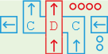

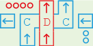

The left and right shift units are not needed to create a hex8 machine. Here is
nonetheless an explanation of how they work.

The shifters take a data input, shift it by a number of bits and send it out
again. The shift is "logical" not "arithmetic", i.e. bits shifted in are always
0 - shifting `1111` 2 bits to the right gives `0011`. The data input/output are
the ports in the middle of the top and bottom of the shifter and marked "D" in
the diagram.

The control input on the right of the shifter takes a two-bit signal in the form
`**XX` indicating the number of bits to shift, i.e. `**10` shifts by 2 bits.

To chain multiple shifters to produce an 8-bit or higher shifter, two control
chains are required: first you connect the left control out of the rightmost
shifter to the right control in of the next one etc. This signal is simply
passed through. Then, connect the top control output (marked "C" in the diagram)
to the bottom control input of the next shifter; for left shifters this control
signal flows right to left but for right shifters it flows left to right.

The idea here is as follows. Suppose you want to shift `0011 0000` to the right
by 2 bits. The leftmost of the two right shifters takes `0011`, shifts it to the
right by two bits producing `0000` and outputs this. But this on its own would
forget about the 1s. So the leftmost right shifter tells the one to its right
over the "C" control path that goes left to right about these bits (the exact
bit pattern is not important for us), resulting in these two bits appearing in
the rightmost right shifter's output to create the result `0000 1100`.

### Use

Shifters are not required to build a hex8 machine.
